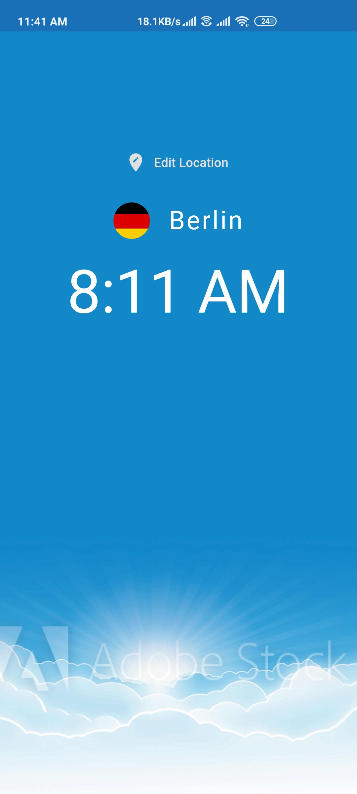
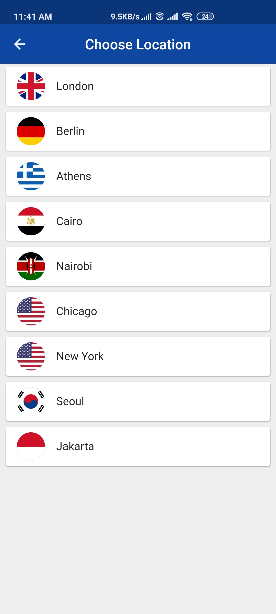

# World Time

World Time is a flutter app which shows you the time in different places of the world. You can choose a location by tapping on the edit location button on the home screen. Then you will be directed to another screen showing a list of locations to choose from, and you can select any one of them, resulting in updated time on the home screen.

Also, the background of the home screen changes depending upon what time it is in the selected location.

The app uses the <a href="http://worldtimeapi.org/">World Time API</a> to get time in different locations of the world.

## Screenshots

<table>
  <tr>
    <th>Home Screen (Day)</th>
    <th>Home Screen (Night)</th>
    <th>Choose Location Screen</th>
  </tr>
  <tr>
    <td></td>
    <td></td>
    <td></td>
  </tr>
</table>
